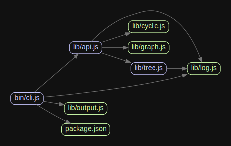

__Questions__

- Why is it possible to import stuffs from other JavaScript files?
    - I mean in a browser runtime some code run to define the functions, variables, etc. and all the code run after that can use the defined functions, variables (presumably no code modify them). JavaScript in browser cares about the execution order of the scripts. `import` and `export` do not even work in Developer Console.
- [x] What does `import` actually do? - [Nothing](https://hacks.mozilla.org/2015/08/es6-in-depth-modules/)
- [x] What does `require()` do in NodeJS? - [Pseudocode](https://nodejs.org/api/modules.html#modules_all_together)

The `require` function definition for (non-native) modules in NodeJS.

```js
function require(path) {
  try {
    exports.requireDepth += 1;
    return mod.require(path);
  } finally {
    exports.requireDepth -= 1;
  }
}
```



> When you run a module containing an import declaration, the modules it imports are loaded first, then each module body is executed in a depth-first traversal of the dependency graph, avoiding cycles by skipping anything already executed.

## CommonJS in NodeJS

__Questions__

<!-- - Top-level variable is `module`? -->
- [x] How module is loaded in NodeJS?

__What I found__

> Variables local to the module will be private, because the module is wrapped in a function by Node.js

<!-- - Module returns the `module.export` object. -->
- Module variables is function scoped.
- I can not implicit create global variables in NodeJS modules. For example:

    - In browser:

    ```js
    function() {
        x = 0; // x will become or modify global variable after the function is called.
    }
    ```

    - In NodeJS module:

    ```js
    x = 0; // will throw error
    ```

## AMD in dojo

- [x] How dojo loads modules?

    - dojo resolves the module path based on the dojo script path, configuration, module id, etc.
    - inject the `<script>` tag into the document and execute callback on finish loading.

### `define`

For defining an AMD module.

__Definition__

```js
var def = function(
    mid,          //(commonjs.moduleId, optional)
    dependencies, //(array of commonjs.moduleId, optional) list of modules to be loaded before running factory
    factory       //(any)
){...}
```

__Usage__

```js
define([
    // The dojo/dom module is required by this module, so it goes
    // in this list of dependencies.
    'dojo/dom'
], function (dom) {
    // Once all modules in the dependency list have loaded, this
    // function is called to define the demo/myModule module.
    //
    // The dojo/dom module is passed as the first argument to this
    // function; additional modules in the dependency list would be
    // passed in as subsequent arguments.

    var oldText = {};

    // This returned object becomes the defined value of this module
    return {
        setText: function (id, text) {
            var node = dom.byId(id);
            oldText[id] = node.innerHTML;
            node.innerHTML = text;
        },

        restoreText: function (id) {
            var node = dom.byId(id);
            node.innerHTML = oldText[id];
            delete oldText[id];
        }
    };
})
```

### `require`

__Definition__

```js
req = function(
    config,       //(object, optional) hash of configuration properties
    dependencies, //(array of commonjs.moduleId, optional) list of modules to be loaded before applying callback
    callback	  //(function, optional) lambda expression to apply to module values implied by dependencies
){...}
```

__Usage__

```js
require([
    'dojo/dom',
    'dojo/dom-construct'
], function (dom, domConstruct) {
    var greetingNode = dom.byId('greeting');
    domConstruct.place('<em> Dojo!</em>', greetingNode);
});
```

### Asynchronous modules loading

- Modules are not finished loading at the same time so how?

## ESM (ECMAScript Modules)

This is the native JavaScript module system supported in most "up-to-date" browser.

## Bundler (webpack, parcel, etc.)

- They run on NodeJS runtime.
- They load dependencies.
- They use Babel (and may be other libraries) to transpile JavaScript compatible with a specific JavaScript specification (ES3, ES6, etc.) and runtime (browser, NodeJS, etc.).
- They have their own module system implemented inside the bundled file when bundled for browser use.

    - [Webpack](./examples/bundlers/webpack)
    - [Parcel](./examples/bundlers/parcel)


## References

- Basic website using ESM - https://github.com/mdn/js-examples/tree/ee35745f57c9768106ff7f4b21200abf6702ca94/modules/basic-modules
- MDN guide on ESM - https://developer.mozilla.org/en-US/docs/Web/JavaScript/Guide/Modules
- NodeJS support for ESM - https://nodejs.org/api/esm.html
- CommonJS modules in NodeJS - https://nodejs.org/api/modules.html
- ES6 In Depth: Modules - https://hacks.mozilla.org/2015/08/es6-in-depth-modules/
- `importScripts` - https://developer.mozilla.org/en-US/docs/Web/API/WorkerGlobalScope/importScripts